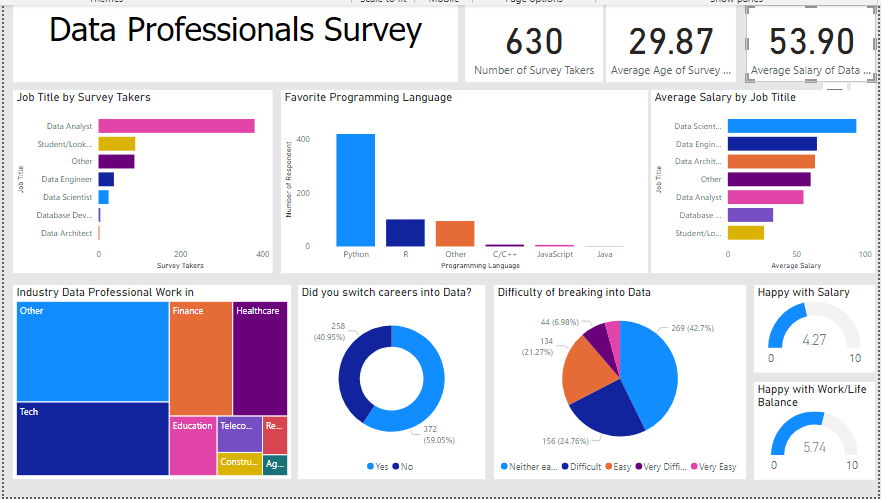

# Data-Professionals-Survey-Analysis-and-Visualization

## Introduction

This project aims to analyze and visualize insights gathered from a dataset related to the data profession. The dataset was collected by a data analyst, cleaned, and then subjected to various analyses to extract meaningful information. The project covers several key performance indicators (KPIs) such as the demographics of survey takers, job titles, programming language preferences, average salaries by job title, industries data professionals work in, career transition statistics, perceptions about breaking into the data field, and overall job satisfaction metrics.

## Dataset Summary

- Total Survey Takers: 630
- Average Age: 29.87
- Average Salary: $53.90K USD

## Visualizations

### 1. Job Titles Distribution

A bar chart illustrates the distribution of survey takers by job titles. The most common job title is "Data Analyst."

### 2. Favorite Programming Language

A bar chart showcases the favorite programming languages among survey takers. Python is the most preferred, followed by R.

### 3. Average Salary by Job Title

A bar chart presents the average salary by job title. Data Scientists receive the highest average salary, followed by Data Engineers.

### 4. Industries Worked In

A bar chart highlights the industries where data professionals mostly work. The top industries include Tech, Finance, Healthcare, and Education. An "Others" category was created during data cleaning to accommodate variations in industry names.

### 5. Career Transition into Data Profession

A donut chart displays the percentage of survey takers who switched into the data profession versus those who were originally students in the field. About 59% switched into the data profession, while the rest were already in it.

### 6. Perceived Difficulty of Breaking into Data Field

A bar chart illustrates the perceived difficulty of breaking into the data field. The majority (42.7%) find it neither easy nor hard, followed by 24% finding it difficult and 21% finding it easy.

### 7. Job Satisfaction with Salary

A bar chart reveals the level of job satisfaction with salary. On a scale of 10, the average satisfaction rating is 4.27.

### 8. Job Satisfaction with Work/Life Balance

A bar chart indicates the level of job satisfaction with work/life balance. On a scale of 10, the average satisfaction rating is 5.74.

## Conclusion

This project offers valuable insights into the data profession based on the provided dataset. Key findings include the prevalence of the Data Analyst job title, the popularity of Python as the preferred programming language, and the industries where data professionals are predominantly employed. The project also provides perspectives on career transition statistics, perceived difficulty in breaking into the data field, and overall job satisfaction metrics related to salary and work/life balance.

These visualizations and analyses contribute to a better understanding of the data profession's landscape, challenges, and satisfaction factors. Researchers, practitioners, and those interested in the data field can use these insights to make informed decisions and gain deeper insights into the profession.
